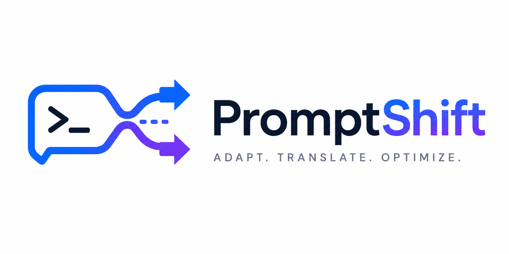

# PromptShift
[](https://reporanker.com/repos/Alvaro-Manzo/promptshift)
[](LICENSE)  
[](https://github.com/Alvaro-Manzo/promptshift)  
[](SKILL.md)

> PromptShift is a model-aware prompt adapter for Claude.

It improves prompts by making them clearer and more reliable — without changing what the user actually meant.

---

## 🧠 What PromptShift Does

Most prompt optimizers change your intent without realizing it.

PromptShift does the opposite:

> **It rewrites prompts while preserving intent as the highest constraint.**

It improves:
- Clarity
- Structure
- Consistency across models

Without adding:
- New goals
- New requirements
- Artificial complexity

---

## ⚙️ Why It Exists

Prompt optimization tools often "help" by rewriting your prompt into something more verbose, like:

**Input**

```text
Summarize this article.
```

Typical optimizer output (problematic):

```text
Act as an expert analyst and provide strategic insights, risks, and implications...
```

That's not the same task anymore. PromptShift treats that as intent drift.

### 🧩 Core Principles
- **Clarity first** — Remove ambiguity before adding structure.
- **Preserve intent** — Never invent goals, audiences, or constraints.
- **Minimal change** — If the prompt is already good → leave it.
- **Model-aware (not model-dependent)** — Adapt only when it measurably improves output.
- **No prompt inflation** — Avoid unnecessary roles, fluff, or "AI personas".

### 🔄 How It Works

Prompt Input
     ↓
Triage (Simple / Complex)
     ↓
Clarify Ambiguity
     ↓
Repair Weak Constraints
     ↓
Minimal Model Adaptation
     ↓
Optimized Prompt

### 📦 What It Can Do

PromptShift can:
- Clean ambiguous prompts
- Normalize structure
- Fix missing constraints
- Detect missing output formats
- Adapt prompts across model families
- Improve consistency across LLMs

### 🚫 What It Does NOT Do

PromptShift does NOT:
- Invent requirements
- Add fake expertise or roles
- Inflate prompts for appearance
- Guarantee better outputs
- Replace prompt iteration
- Override user intent

### 🧪 Example

**Input**

```text
Summarize the attached article about recent climate policy developments and their implications for global emissions.
```

**Output**

## ANALYSIS
The prompt is underspecified: no output format or constraints defined.

## OPTIMIZED PROMPT
Summarize the attached article about recent climate policy developments and their implications for global emissions.

Requirements:
- 6 bullet points
- 1 sentence per bullet
- Maximum 200 words

## CHANGES
Added explicit structure and length constraint.

## CONFIDENCE
High

The task is unchanged — only clarity is improved.

### 🧠 Supported Model Profiles

PromptShift includes lightweight adaptation rules for:

- Claude (Opus / Sonnet / Haiku)
- GPT (reasoning models)
- Gemini
- Grok
- DeepSeek
- Llama
- Mistral
- Qwen / Kimi
- Command R+

These are heuristics, not guarantees.

### 📊 Design Philosophy

PromptShift is not:

- a prompt generator
- a persona builder
- a prompt marketing tool

It is:

A minimal transformation layer between intent and execution.

### 🧪 Benchmarking

The repo includes benchmark cases for:

- Coding
- UI generation
- Writing tasks
- Reasoning tasks
- RAG-style prompts

See `./benchmarks` for details.

### 📥 Installation

```bash
git clone https://github.com/Alvaro-Manzo/promptshift.git
```

Copy `SKILL.md` into your Claude Skills directory and enable it.

### 🤝 Contributing

Contributions are welcome, especially for:

- Edge cases where intent drift happens
- Model-specific failure patterns
- Better evaluation benchmarks

Please read CONTRIBUTE.md before making any PR or Issue, include reasoning, not just edits.

### 📜 License

MIT © 2026 Alvaro-Manzo
